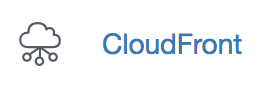
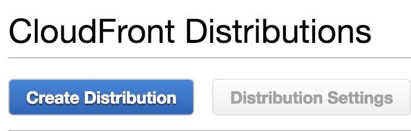
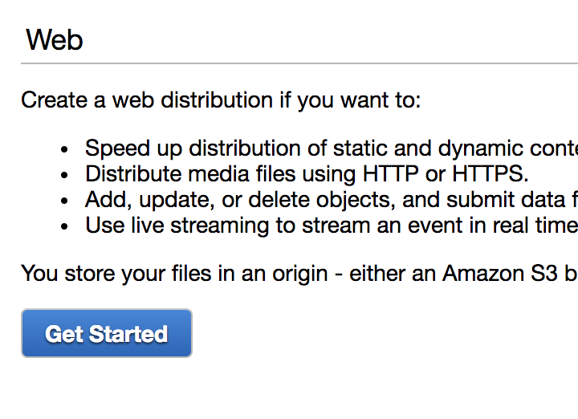
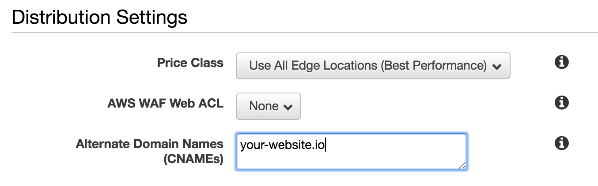
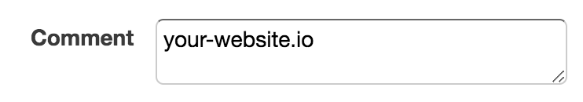
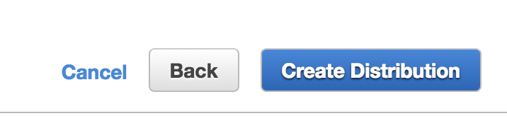
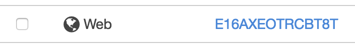
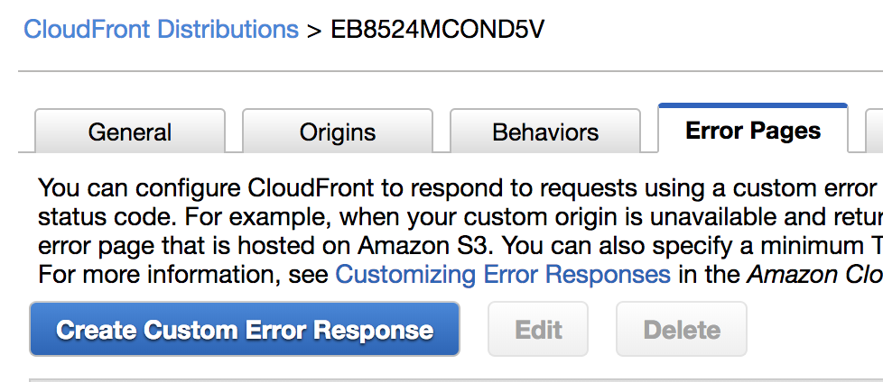
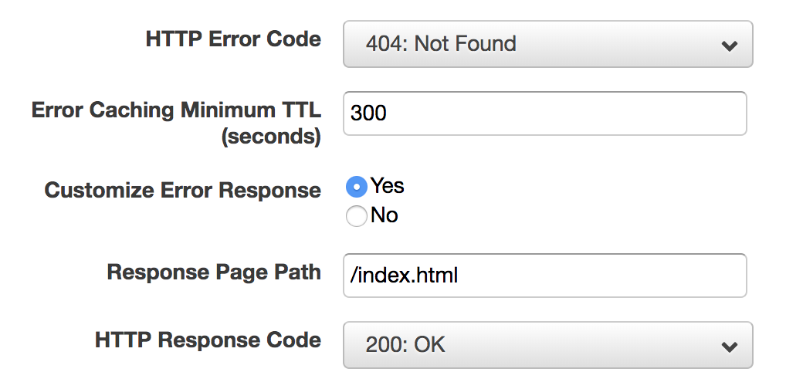

## Configuring CloudFront for a Static S3 Website

- Got to CloudFront

    

- Create a Distribution

    

- Select Web

    

- Set the `Origin Domain name` to the url of your bucket's static website

- Add your domain to `Alternate Domain Names (CNAMEs)`

    

- (bonus) Comment your website's domain so that it's easy to find latter

    

- Create it!

    

- Select it from the list

    

- Go to Error Pages and Create a Custom Error Response

    

    This is recommended since static websites return a 404 on all routes except for '/'.
    It will still work fine without this, but crawlers and techy clients might notice

- Edit your error response to look like this

    
